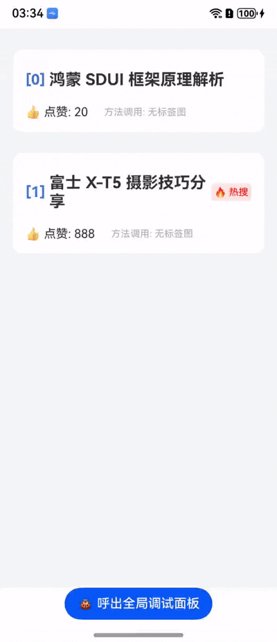
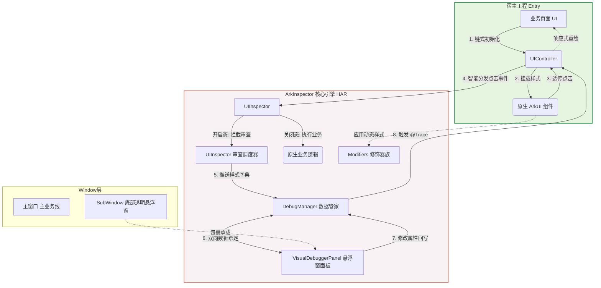

# ArkInspector 🔍

   
###  预览
#### 实时数据修改驱动UI更新
<p align="center">
  
</p>

#### UI检查器修改驱动UI更新
<p align="center">
  
</p>

**ArkInspector** 是一个专为鸿蒙 ArkUI 打造的**纯端侧、零反射、高扩展**的可视化 UI 调试神器。

在原生鸿蒙开发中，由于 ArkUI 的纯声明式底层架构，开发者常常苦于无法像网页 F12 或 Android DoKit 那样在脱离 PC 的真机环境下直接审查和微调 UI。ArkInspector 巧妙利用 ArkUI 的 `AttributeModifier` 机制，让你在真机上实现“指哪打哪”的像素级微调。

## ✨ 核心特性

* 🎯 **精准拾取 (UIInspector)：** 开启审查模式后，点击屏幕任意已绑定的控件，瞬间唤起红色虚线高亮框，实现真正的端侧 DOM 审查体验。自动管理焦点，单选排他。
* 💎 **优雅的链式语法 (Builder)：** 提供 TextStyleBuilder 等原生级样式构建器，支持强类型提示的链式调用，告别丑陋的 JSON 字典硬编码。
* 🔌 **极简探针接入 (UIController)：** 业务层只需实例化一个 UIController，框架全自动接管数据双向绑定与 UI 刷新。零 if-else，零探针回调逻辑污染！
* ⚡️ **实时数据绑定修改重绘：** 底部悬浮控制台绑定需要的数据。修改数据中的值，实现真机 UI 瞬间重绘，无需重新编译！
* ⚡️ **实时修改与重绘：** 底部悬浮控制台自动拉取选中控件的属性字典。修改任意数值（如 `fontSize`、`padding`），真机 UI 瞬间重绘，无需重新编译！
* 🚀 **零性能损耗：** 彻底抛弃低效的反射机制，全量基于 ArkUI 官方推荐的 `AttributeModifier` 动态修饰器打造，对业务代码侵入极低。
* 🧰 **V1/V2 状态全兼容：** 底层调度引擎完美解耦了状态管理机制，无论你的业务页面使用的是 `@State` 还是 `@Local`，均可无缝触发刷新。

## 🏗️ 核心架构与原理

本库采用高内聚、低耦合的模块化设计。通过独立的子窗口（SubWindow）承载调试面板，彻底隔离业务视图。


## 核心原理解析
#### 1.UIInspector (审查拦截器)： 包装在组件的 onClick 事件外层。当处于“审查模式”时，它会拦截原生点击事件，获取控件绑定的样式字典，并通知当前控件绘制红色虚线边框，同时将焦点数据推送到后台管家。

#### 2.数据修改驱动 (Data-Driven UI)： 当你在 VisualDebuggerPanel 悬浮窗中修改了某个字段（如将 18 改为 24），面板会将新对象通过 DebugManager 的回调函数回传给原业务页面。业务页面的状态变量发生改变，触发 ForEach 或组件的局部重绘，新的样式被 AttributeModifier 重新解析并应用到屏幕上。

## 📦 快速开始
#### 1. 初始化引擎
   在你的 EntryAbility.ets 中，为管家注入窗口舞台（WindowStage）和你的宿主面板路径：
   ```ts
import { DebugWindowManager } from 'arkinspector';

export default class EntryAbility extends UIAbility {
  onWindowStageCreate(windowStage: window.WindowStage): void {
    // 初始化探针窗口管家
    DebugWindowManager.init(windowStage, "pages/DebugOverlayPage");
    
    windowStage.loadContent('pages/Index', (err) => { /* ... */ });
  }
}
  ```
#### 2. 在业务代码中接入
将你的静态样式抽离为字典，并绑定探针：
```ts
import {
  DebugWindowManager,
  DynamicTextModifier,
  DynamicColumnModifier,
  TextStyleBuilder,
  ColumnStyleBuilder,
  UIController
} from 'arkinspector';

@Entry
@ComponentV2
struct RealWorldListPage {

  // 💥 1. 唯一真相源：使用 Controller + Builder 链式初始化样式
  @Local titleCtrl: UIController = new UIController(
    new TextStyleBuilder()
      .fontSize(15)
      .fontColor('#333333')
      .padding({top: 10, bottom: 10})
      .fontWeight(FontWeight.Bold)
      .layoutWeight(1)
      .build()
  );

  @Local cardCtrl: UIController = new UIController(
    new ColumnStyleBuilder()
      .width('100%')
      .backgroundColor(Color.White)
      .borderRadius(12)
      .padding(16)
      .build()
  );

  // 💥 (可选) 2. 业务侧原生语法代理：如果你极度怀念 this.fontSize = 50 的原生赋值体验
  get titleFontSize(): number { return this.titleCtrl.style['fontSize'] as number; }
  set titleFontSize(v: number) { this.titleCtrl.update('fontSize', v); }

  build() {
    Column() {
      // --- 列表卡片组件 ---
      Column({ space: 10 }) {
        
        // --- 标题组件 ---
        Text("鸿蒙 SDUI 框架原理解析")
          // 💥 3. 绑定修饰器
          .attributeModifier(new DynamicTextModifier(this.titleCtrl.style, 'news_title_1'))
          // 💥 4. 一键绑定探针！完美透传你的原生业务点击逻辑
          .onClick(this.titleCtrl.bindInspector('news_title_1', () => {
             console.log("原生业务逻辑：跳转到新闻详情页...");
          }))

      }
      .attributeModifier(new DynamicColumnModifier(this.cardCtrl.style, 'card_1'))
      .onClick(this.cardCtrl.bindInspector('card_1'))


      // --- 业务代码动态修改测试 ---
      Button("代码动态修改字体")
        .onClick(() => {
          // 方式 A：通过代理直接赋值 (原生体验)
          this.titleFontSize = 30; 
          
          // 方式 B：通过 Controller 直接 update
          // this.titleCtrl.update('fontSize', 30);
        })

      Button("🐞 呼出全局调试面板")
        .onClick(() => {
          DebugWindowManager.showDebugger();
        })
    }
    .height('100%').width('100%').padding(16).backgroundColor('#F5F6F8')
  }
}
 ```
## 🧩 已支持的修饰器 (Modifiers)
DynamicTextModifier (文本)

DynamicColumnModifier (纵向布局)

DynamicRowModifier (横向布局)

DynamicImageModifier (图片)

DynamicButtonModifier (按钮)

DynamicListModifier (列表)

DynamicStackModifier (层叠布局)

DynamicFlexModifier (弹性布局)

欢迎提交 PR 补充更多原生组件的修饰器！
## 🤝 参与贡献
极其欢迎任何形式的贡献！你可以通过提交 Issue 报告 Bug，或者发起 Pull Request 来增加新的 Modifier 支持或优化交互体验。

## 📄 开源协议
本项目基于 MIT License 协议开源。