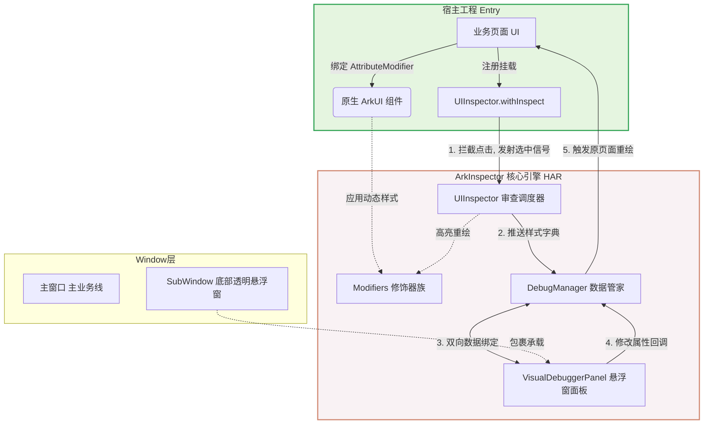

# ArkInspector 🔍

   
###  预览
#### 实时数据修改驱动UI更新
<p align="center">
  
</p>

#### UI检查器修改驱动UI更新
<p align="center">
  
</p>

**ArkInspector** 是一个专为鸿蒙 ArkUI 打造的**纯端侧、零反射、高扩展**的可视化 UI 调试神器。

在原生鸿蒙开发中，由于 ArkUI 的纯声明式底层架构，开发者常常苦于无法像网页 F12 或 Android DoKit 那样在脱离 PC 的真机环境下直接审查和微调 UI。ArkInspector 巧妙利用 ArkUI 的 `AttributeModifier` 机制，让你在真机上实现“指哪打哪”的像素级微调。

## ✨ 核心特性

* 🎯 **精准拾取 (UIInspector)：** 开启审查模式后，点击屏幕任意已绑定的控件，瞬间唤起红色虚线高亮框，实现真正的端侧 DOM 审查体验。自动管理焦点，单选排他。
* ⚡️ **实时数据绑定修改重绘：** 底部悬浮控制台绑定需要的数据。修改数据中的值，实现真机 UI 瞬间重绘，无需重新编译！
* ⚡️ **实时修改与重绘：** 底部悬浮控制台自动拉取选中控件的属性字典。修改任意数值（如 `fontSize`、`padding`），真机 UI 瞬间重绘，无需重新编译！
* 🚀 **零性能损耗：** 彻底抛弃低效的反射机制，全量基于 ArkUI 官方推荐的 `AttributeModifier` 动态修饰器打造，对业务代码侵入极低。
* 🧰 **V1/V2 状态全兼容：** 底层调度引擎完美解耦了状态管理机制，无论你的业务页面使用的是 `@State` 还是 `@Local`，均可无缝触发刷新。

## 🏗️ 核心架构与原理

本库采用高内聚、低耦合的模块化设计。通过独立的子窗口（SubWindow）承载调试面板，彻底隔离业务视图。


## 核心原理解析
#### 1.UIInspector (审查拦截器)： 包装在组件的 onClick 事件外层。当处于“审查模式”时，它会拦截原生点击事件，获取控件绑定的样式字典，并通知当前控件绘制红色虚线边框，同时将焦点数据推送到后台管家。

#### 2.数据修改驱动 (Data-Driven UI)： 当你在 VisualDebuggerPanel 悬浮窗中修改了某个字段（如将 18 改为 24），面板会将新对象通过 DebugManager 的回调函数回传给原业务页面。业务页面的状态变量发生改变，触发 ForEach 或组件的局部重绘，新的样式被 AttributeModifier 重新解析并应用到屏幕上。

## 📦 快速开始
#### 1. 初始化引擎
   在你的 EntryAbility.ets 中，为管家注入窗口舞台（WindowStage）和你的宿主面板路径：
   ```ts
import { DebugWindowManager } from 'arkinspector';

export default class EntryAbility extends UIAbility {
  onWindowStageCreate(windowStage: window.WindowStage): void {
    // 初始化探针窗口管家
    DebugWindowManager.init(windowStage, "pages/DebugOverlayPage");
    
    windowStage.loadContent('pages/Index', (err) => { /* ... */ });
  }
}
  ```
#### 2. 在业务代码中接入
将你的静态样式抽离为字典，并绑定探针：
```ts
import {
  DebugManager,
  DebugWindowManager,
  UIInspector,
  DynamicTextModifier,
  DynamicColumnModifier
} from 'arkinspector'; // 💥 从你的独立库中引入
import { NewsItem } from './NewsItemModel';
import { JSON } from '@kit.ArkTS';

// ==========================================
// 3. 真实业务页面与探针的结合
// ==========================================
@Entry
@ComponentV2
struct RealWorldListPage {
  @Local newsList: NewsItem[] = [];

  @Local titleStyle: Record<string, Object> = {
    'fontSize': 18,
    'fontColor': '#333333',
    'fontWeight': 'bold',
    'padding': { 'top': 10, 'bottom': 10 } as Record<string, number>,
    'layoutWeight': 1
  };

  @Local cardStyle: Record<string, Object> = {
    'width': '100%',
    'backgroundColor': '#FFFFFF',
    'borderRadius': 12,
    'padding': 16,
    'margin': { 'top': 10 } as Record<string, number>
  };

  // 💥 关键新增：专门用来打破 ForEach 渲染缓存的触发器
  // @Local inspectTick: number = 0;

  aboutToAppear() {
    let news1 = new NewsItem();
    news1.news_title = "鸿蒙 SDUI 框架原理解析";
    news1.praise_count = 100;

    let news2 = new NewsItem();
    news2.news_title = "富士 X-T5 摄影技巧分享";
    news2.praise_count = 888;
    news2.is_hot = true;

    this.newsList = [news1, news2];

    // 💥 绑定真实数据，通过弹窗可以修改，实现重绘
    DebugManager.register("listData", this.newsList, (newVal: ESObject) => {
      this.newsList = newVal as NewsItem[];
    });
  }

  aboutToDisappear(): void {
    //💥 取消绑定真实数据
    DebugManager.unregister("listData");
  }

  build() {
    Column() {
      List({ space: 16 }) {
        ForEach(this.newsList, (item: NewsItem, index: number) => {
          ListItem() {
            Column({ space: 10 }) {
              Row() {
                Text(`[${index}] `).fontSize(18).fontWeight(FontWeight.Bold).fontColor('#3E75D8')

                // --- 标题组件 ---
                Text(item.news_title)
                  .attributeModifier(new DynamicTextModifier(this.titleStyle, `news_title_${index}`))
                  .onClick(UIInspector.withInspect(`news_title_${index}`, this.titleStyle, (newStyle: ESObject) => {
                    this.titleStyle = newStyle as Record<string, Object>;
                    // this.inspectTick++; // 💥 强制触发页面重绘
                  }))

                if (item.is_hot) {
                  Text("🔥 热搜")
                    .fontSize(12).fontColor('#FF0000').padding(4)
                    .backgroundColor('#FFE5E5').borderRadius(4)
                }
              }.width('100%')

              Row({ space: 20 }) {
                Text(`👍 点赞: ${item.praise_count}`).fontSize(15)
                Text(`方法调用: ${item.getTagImg()}`).fontSize(12).fontColor('#AAAAAA')
              }.width('100%')
            }
            // --- 卡片(Column)组件 ---
            .attributeModifier(new DynamicColumnModifier(this.cardStyle, `card_style_${index}`))
            .onClick(UIInspector.withInspect(`card_style_${index}`, this.cardStyle, (newStyle: ESObject) => {
              // 💥 修复：这里现在绑定的是卡片自己的 cardStyle
              this.cardStyle = newStyle as Record<string, Object>;
              // this.inspectTick++; // 💥 强制触发页面重绘
            }))
          }
        },
          // 💥 关键修复：把 inspectTick 拼接到 Key 里，这样每次属性改变，ForEach 都会乖乖重绘！
          (item: NewsItem, index: number) => JSON.stringify(item))
      }
      .width('100%').padding(16).backgroundColor('#F5F6F8').layoutWeight(1)

      Button("🐞 呼出全局调试面板")
        .onClick(() => {
          DebugWindowManager.showDebugger();
        })
    }
    .height('100%')
    .width('100%')
  }
}
 ```
## 🧩 已支持的修饰器 (Modifiers)
DynamicTextModifier (文本)

DynamicColumnModifier (纵向布局)

DynamicRowModifier (横向布局)

DynamicImageModifier (图片)

DynamicButtonModifier (按钮)

DynamicListModifier (列表)

DynamicStackModifier (层叠布局)

DynamicFlexModifier (弹性布局)

欢迎提交 PR 补充更多原生组件的修饰器！
## 🤝 参与贡献
极其欢迎任何形式的贡献！你可以通过提交 Issue 报告 Bug，或者发起 Pull Request 来增加新的 Modifier 支持或优化交互体验。

## 📄 开源协议
本项目基于 MIT License 协议开源。